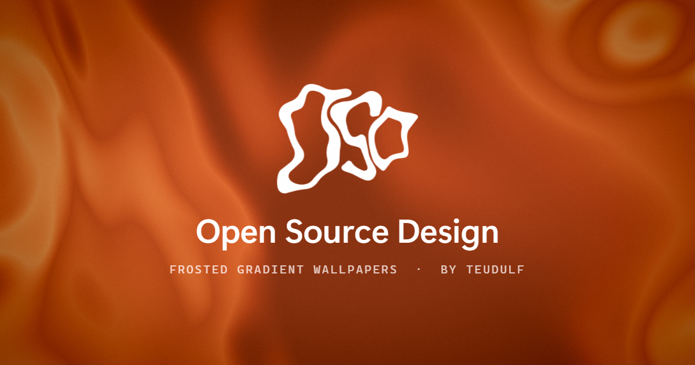

# OSD — Open Source Design

Frosted-glass gradient wallpapers for every screen you own, made in the browser.
**Live:** https://osd.teudulf.com · **Source:** https://github.com/Teudulf/Open-Source-Design · by [Teudulf](https://teudulf.com) ([@teudulf](https://instagram.com/teudulf))

## What it does

- **Multi-monitor wallpapers** — lay out your displays at their real physical size, so one continuous gradient flows across screens of different sizes and pixel densities. Export one image per display or a single spanned image.
- **Detect displays** — reads your real screens (resolution, rotation, Windows positions) in Chrome/Edge.
- **Four styles** — soft *Blobs*, thermal *Heatmap*, domain-warped *Fluid* (ink → marble), or your own *Image*.
- **Color** — curated presets, plus a palette generator built on color theory in OKLCH (analogous, complementary, triadic…), with per-color locks.
- **Glass** — fluted, reeded, diagonal, dimpled, wavy, pyramid, tiles and zigzag refraction.
- **Texture** — film grain and halftone.
- **Layers** — text and PNG/SVG graphics, with solid, glow, frosted and tinted styles, optionally behind the glass.
- **Phone mode** — below 768 px wide it becomes a phone wallpaper maker, sized to your device.

Everything runs locally in your browser. Nothing is uploaded; your images, fonts and graphics never leave your device.

## Use it

Open https://osd.teudulf.com, or download `index.html` and open it in Chrome or Edge — the whole app is that one file.

Keys: `+` / `-` zoom the preview, `0` fits, hold `Space` and drag to pan. Drag on the stage to move blobs, pan an image or the fluid; `Shift`+drag slides the glass pattern.

Setting a Windows wallpaper per monitor: Settings › Personalization › Background › right-click an image › *Set for monitor N*. For a spanned image choose the *Span* fit.

## Project layout

| Path | What |
|---|---|
| `index.html` | The entire app — HTML, CSS, WebGL shader and JS, no build step, no dependencies |
| `og-image.png` | Social preview card (rendered with OSD) |
| `logo/logo.png` | The OSD mark |
Self-test: open `index.html#test` and check the console for `selftest ok`.

## License

[GPL-3.0](LICENSE) © Teudulf. You may use, study, modify and share OSD; anything you distribute that's based on it must also be released under the GPL-3.0 with its source.
